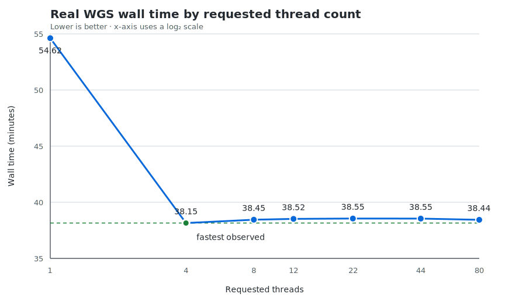

# TelSeq Parallel

TelSeq Parallel estimates average telomere length from whole-genome sequencing
BAM files. It is a multithreaded fork of
[zd1/telseq](https://github.com/zd1/telseq) and adds indexed parallel scanning
of a single BAM with `-t` / `--threads`.

This is an independently maintained fork, not the official upstream TelSeq
distribution. The calculation and tabular output are kept compatible with the
original program, including its legacy counting behavior.

## Installation

### Docker

The easiest installation is the released Linux AMD64 image:

```bash
docker pull ghcr.io/michtrofimov/telseq-parallel:0.2.0
```

Check the installed version:

```bash
docker run --rm \
    ghcr.io/michtrofimov/telseq-parallel:0.2.0 \
    --version
```

See [Using the Docker image](#using-the-docker-image) for a complete BAM
example.

### Build from source

Required build dependencies are:

- a C++11 compiler;
- Autoconf and Automake;
- the [BamTools](https://github.com/pezmaster31/bamtools) development library;
- the [HTSlib](https://github.com/samtools/htslib) development library;
- zlib development headers;
- POSIX threads.

On Debian or Ubuntu, the required packages can be installed with:

```bash
sudo apt-get update
sudo apt-get install \
    autoconf automake build-essential libbamtools-dev libhts-dev zlib1g-dev
```

Build from the repository root:

```bash
cd src
./autogen.sh
./configure
make
./Telseq/telseq --version
```

The executable is created at `src/Telseq/telseq`. If BamTools is installed in
a non-system location, pass the directory containing its `include` and `lib`
subdirectories:

```bash
./configure --with-bamtools=/path/to/bamtools
make
```

Use `--with-htslib=/path/to/htslib` in the same way when HTSlib is installed
outside the system include and library paths.

An installation prefix can also be selected in the usual way:

```bash
./configure --prefix="$HOME/.local"
make
make install
```

## Input requirements

TelSeq Parallel reads BAM files. It does not read SAM or CRAM directly.

For the original sequential mode, `-t 1`, a BAM index is not required. For
parallel mode, `-t > 1`, each BAM must:

- be sorted by coordinate;
- declare `SO:coordinate` in its header; and
- have a standard BAI index next to it, readable by both BamTools and HTSlib.

Common accepted index layouts are:

```text
sample.bam
sample.bam.bai
```

or:

```text
sample.bam
sample.bai
```

TelSeq normally reports results by read group. Read-group IDs should be
declared in the BAM header and reads should carry matching `RG` tags. Use `-u`
to ignore read groups and treat all reads in each BAM as one group.

Set `-r` to the sequencing read length used for the analysis. Its default is
100 bases. This parameter affects the estimate and the number of `TEL` columns
in the output, so it must be the same when comparing runs.

## Usage

### One BAM

Run the original sequential path:

```bash
telseq -r 151 sample.bam > sample.telseq.tsv
```

Scan the same BAM with 22 threads:

```bash
telseq -t 22 -r 151 sample.bam > sample.telseq.tsv
```

For `-t > 1`, one requested thread is reserved for a short HTSlib compatibility
scan and the remaining threads consume complete reference-sequence tasks
dynamically. For example, `-t 22` permits up to 21 indexed reference workers
plus the compatibility scanner. The scanner retrieves the no-coordinate tail
directly through the BAI instead of reading the complete BAM. A chromosome is
not permanently assigned to a particular worker and is not divided between
multiple workers.

### Multiple BAMs

Paths can be provided as positional arguments:

```bash
telseq -t 22 -r 151 sample1.bam sample2.bam > results.tsv
```

They can also be stored in a one-column file:

```text
/data/sample1.bam
/data/sample2.bam
```

```bash
telseq -t 22 -r 151 -f bamlist.txt > results.tsv
```

Or passed on standard input:

```bash
printf '%s\n' /data/sample1.bam /data/sample2.bam | \
    telseq -t 22 -r 151 > results.tsv
```

When multiple BAMs are supplied, TelSeq processes them one at a time. The
thread count applies to the BAM currently being scanned.

### Output destination and logs

Results are written to standard output and progress messages to standard
error. Keep them separate when redirecting:

```bash
telseq -t 22 -r 151 sample.bam \
    > sample.telseq.tsv \
    2> sample.telseq.log
```

`-o` can be used instead of stdout redirection:

```bash
telseq -t 22 -r 151 -o sample.telseq.tsv sample.bam
```

## Parameters

| Option | Default | Meaning |
| --- | ---: | --- |
| `-t INT`, `--threads=INT` | `1` | Threads requested for one BAM. Valid range: 1–1024. Values greater than 1 require a coordinate-sorted, indexed BAM. |
| `-r INT` | `100` | Read length in bases. Controls the supported motif-count range and therefore the number of `TEL` columns. |
| `-k INT` | `7` | Minimum number of `TTAGGG` or `CCCTAA` repeats for a read to contribute to the telomeric-read numerator. |
| `-f FILE`, `--bamlist=FILE` | — | Read BAM paths from a one-column file. Positional BAM arguments are ignored when this is used. |
| `-o FILE`, `--output-dir=FILE` | stdout | Write the result table to this file. The inherited long-option name says “directory”, but the value is a file path. |
| `-H` | off | Suppress the output header. Useful when appending several runs. |
| `-h` | off | Print only the output header and exit. |
| `-m` | off | Merge read groups for a sample using the original TelSeq weighted-mean behavior. |
| `-u` | off | Ignore read groups and treat reads in each BAM as one group. |
| `-w` | off | Treat all supplied BAMs as one logical BAM using the inherited TelSeq behavior. |
| `-z PATTERN` | `TTAGGG` | Search for a custom motif and its reverse complement. |
| `-e BED`, `--exomebed=BED` | — | Exclude reads overlapping regions in the BED file. This is an inherited experimental option. |
| `--help` | — | Print command-line help. |
| `--version` | — | Print the version. |

Use the same `-r`, `-k`, `-z`, `-e`, `-m`, `-u`, and `-w` settings whenever
outputs are compared. Thread count should be the only changing parameter in a
parallel compatibility comparison.

## Output

The output is a tab-separated table. By default it contains one row per read
group per BAM; `-u` and `-m` change that grouping behavior.

| Column | Meaning |
| --- | --- |
| `ReadGroup` | Read-group ID, or `UNKNOWN` when read groups are absent or ignored. |
| `Library` | `LB` value from the BAM read-group header, if available. |
| `Sample` | `SM` value from the BAM read-group header, if available. |
| `Total` | Reads counted for the output group. |
| `Mapped` | Count of reads without SAM flag `0x4`. |
| `Duplicates` | Count of reads with SAM flag `0x400`. |
| `LENGTH_ESTIMATE` | Estimated average telomere length in kilobases, or `UNKNOWN` when it cannot be calculated. |
| `TELn` | Reads containing exactly `n` copies of the motif or its reverse complement. |
| `GCn` | Reads in a two-percentage-point GC bin between 40% and 60%. |

The `TEL` columns depend on read length and motif length. With the default
six-base motif, `-r 100` produces `TEL0` through `TEL16`, while `-r 151`
produces `TEL0` through `TEL25`. A different number of `TEL` columns usually
means the runs used different `-r` or `-z` values.

There are ten GC columns: `GC0` represents 40–42% GC, `GC1` represents
42–44%, and so on through `GC9`, which represents 58–60%.

Print only the header when preparing a combined result file:

```bash
telseq -r 151 -h > combined.tsv
telseq -t 22 -r 151 -H sample1.bam >> combined.tsv
telseq -t 22 -r 151 -H sample2.bam >> combined.tsv
```

## Using the Docker image

The released image targets `linux/amd64`. Mount the directory containing both
the BAM and its index as read-only, then pass ordinary TelSeq parameters after
the image name:

```bash
docker run --rm \
    -v /path/to/bam-directory:/data:ro \
    ghcr.io/michtrofimov/telseq-parallel:0.2.0 \
    -t 22 -r 151 /data/sample.bam \
    > sample.telseq.tsv
```

For this example, the host directory should contain either
`sample.bam.bai` or `sample.bai` alongside `sample.bam`. Shell redirection is
performed by the host, so `sample.telseq.tsv` is created in the current host
directory rather than inside the container.

To process several BAMs from the mounted directory:

```bash
docker run --rm \
    -v /path/to/bam-directory:/data:ro \
    ghcr.io/michtrofimov/telseq-parallel:0.2.0 \
    -t 22 -r 151 /data/sample1.bam /data/sample2.bam \
    > results.tsv
```

Build a local image from the current checkout with:

```bash
docker build -t telseq-parallel:local .
```

## Performance and validation

### Observed real-WGS scaling

The original parallel implementation was compared across 1, 4, 8, 12, 22,
44, and 80 threads on a real WGS BAM. In that environment, wall time fell from
54.62 minutes at `-t 1` to 38.15 minutes at `-t 4`, a 1.43× speedup. Higher
thread counts did not improve wall time: every result from 4 through 80
threads remained within 24 seconds of the fastest run.



Those measurements describe version 0.1, whose compatibility worker still
read the entire BAM. Version 0.2 removes that sequential full-file pass, so
the old `-t 4` optimum should not be assumed for the new implementation.
Storage, cache state, BAM layout, and node hardware can still change the
optimum. See the
[complete benchmark, raw timings, and limitations](benchmarks/real-wgs-2026-07-21/README.md).

In version 0.2 the HTSlib compatibility worker requests only the indexed
no-coordinate records. When that tail is present, the final tail record also
supplies stock TelSeq's legacy EOF contribution. If no no-coordinate tail is
present, the worker scans only the highest populated reference needed to
recover the final physical record. It never performs the old full sequential
BAM pass.

More threads still do not guarantee better performance. Storage bandwidth,
decompression, the number and size of references, and the operating-system
page cache can all limit scaling. Rebenchmark version 0.2 on representative
WGS data before choosing a production thread count.

See [TESTING.md](TESTING.md) for correctness tests, comparison against stock
TelSeq output, benchmark commands, forwarded analysis parameters, and guidance
for interpreting timings.

## Citation and upstream project

If TelSeq is used in research, cite the original publication:

> Zhihao Ding, Massimo Mangino, Abraham Aviv, Tim Spector, and Richard Durbin.
> “Estimating telomere length from whole genome sequence data.”
> *Nucleic Acids Research* 42(9), 2014, e75.
> [doi:10.1093/nar/gku181](https://doi.org/10.1093/nar/gku181)

The original implementation and history are available from
[zd1/telseq](https://github.com/zd1/telseq).

## License

TelSeq Parallel is distributed under the GNU General Public License version 3
(`GPL-3.0-only`). See [LICENSE](LICENSE) for the complete license text.

This fork retains the original TelSeq copyright and attribution. Changes made
for parallel execution are distributed under the same license. The license
text itself is preserved unmodified.

## Contact

For questions and bug reports about this parallel fork, open an issue in the
[TelSeq Parallel issue tracker](https://github.com/michtrofimov/telseq-parallel/issues).

Questions about the original program should be directed to the
[upstream TelSeq repository](https://github.com/zd1/telseq).
