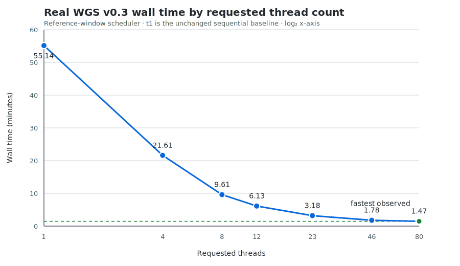

# TelSeq Parallel

TelSeq Parallel estimates average telomere length from whole-genome sequencing
BAM files. It is a multithreaded fork of
[zd1/telseq](https://github.com/zd1/telseq) and adds indexed parallel scanning
of a single BAM with `-t` / `--threads`.

This is an independently maintained fork, not the official upstream TelSeq
distribution. The calculation and inherited result columns are kept compatible
with the original program, including its legacy counting behavior. TelSeq
Parallel appends one additional `K` column reporting the effective repeat
threshold used for each result row.

## Installation

### Docker

The easiest installation is the released Linux AMD64 image:

```bash
docker pull ghcr.io/michtrofimov/telseq-parallel:0.3.2
```

Check the installed version:

```bash
docker run --rm \
    ghcr.io/michtrofimov/telseq-parallel:0.3.2 \
    --version
```

For cluster experiments against the latest tested `master` commit, use the
development image:

```bash
docker pull ghcr.io/michtrofimov/telseq-parallel:master
```

This moving tag is published only after the same container build and test
gates as a release image. Use a numbered release tag for production workflows.

See [Using the Docker image](#using-the-docker-image) for a complete BAM
example.

### Build from source

Required build dependencies are:

- a C++11 compiler;
- Autoconf and Automake;
- the [BamTools](https://github.com/pezmaster31/bamtools) development library;
- the [HTSlib](https://github.com/samtools/htslib) development library;
- zlib development headers;
- POSIX threads.

On Debian or Ubuntu, the required packages can be installed with:

```bash
sudo apt-get update
sudo apt-get install \
    autoconf automake build-essential libbamtools-dev libhts-dev zlib1g-dev
```

Build from the repository root:

```bash
cd src
./autogen.sh
./configure
make
./Telseq/telseq --version
```

The executable is created at `src/Telseq/telseq`. If BamTools is installed in
a non-system location, pass the directory containing its `include` and `lib`
subdirectories:

```bash
./configure --with-bamtools=/path/to/bamtools
make
```

Use `--with-htslib=/path/to/htslib` in the same way when HTSlib is installed
outside the system include and library paths.

An installation prefix can also be selected in the usual way:

```bash
./configure --prefix="$HOME/.local"
make
make install
```

## Input requirements

TelSeq Parallel reads BAM files. It does not read SAM or CRAM directly.

For the original sequential mode, `-t 1`, a BAM index is not required. For
parallel mode, `-t > 1`, each BAM must:

- be sorted by coordinate;
- declare `SO:coordinate` in its header; and
- have a standard BAI index next to it, readable by both BamTools and HTSlib.

Common accepted index layouts are:

```text
sample.bam
sample.bam.bai
```

or:

```text
sample.bam
sample.bai
```

Create or refresh the index with HTSlib/samtools so it includes the metadata
used for direct no-coordinate-tail access:

```bash
samtools index sample.bam
```

Some older BAI writers produce an index that is adequate for reference-region
queries but omits this optional tail metadata. If parallel mode reports that
the index does not support direct no-coordinate access, rebuild the BAI with
`samtools index`; the BAM itself does not need to be rewritten.

TelSeq normally reports results by read group. Read-group IDs should be
declared in the BAM header and reads should carry matching `RG` tags. Use `-u`
to ignore read groups and treat all reads in each BAM as one group.

Set `-r` to the sequencing read length used for the analysis. Its default is
100 bases. This parameter affects the estimate and the number of `TEL` columns
in the output, so it must be the same when comparing runs.

## Usage

### One BAM

Run the original sequential path:

```bash
telseq -r 151 sample.bam > sample.telseq.tsv
```

Scan the same BAM with 22 threads:

```bash
telseq -t 22 -r 151 sample.bam > sample.telseq.tsv
```

For `-t > 1`, one requested thread is reserved for a short HTSlib compatibility
scan and the remaining threads consume indexed reference-window tasks
dynamically. References longer than 25 million bases are divided into windows
by default. For example, `-t 22` permits up to 21 indexed window workers plus
the compatibility scanner. The scanner retrieves the no-coordinate tail
directly through the BAI instead of reading the complete BAM.

Tasks are prioritized using each reference's mapped and positioned-unmapped
record totals from the BAM index, apportioned by window length. This starts
dense short references early instead of leaving them as end-of-run
stragglers. If an index format does not expose those totals, scheduling falls
back to genomic-window length.

With `--primary-chromosomes-only`, only exact human primary reference names
`1` through `22`, `X`, and `Y`, optionally prefixed by `chr`, are scheduled.
The no-coordinate compatibility scan is disabled and all requested threads
can process primary-reference windows. Mitochondrial, alt, decoy, random,
unplaced, and other contig names are excluded.

Adjacent region queries may both fetch a read that spans their boundary.
TelSeq assigns each alignment to the unique window containing its start
coordinate, preventing duplicate contributions while allowing large
chromosomes to use multiple workers.

### Multiple BAMs

Paths can be provided as positional arguments:

```bash
telseq -t 22 -r 151 sample1.bam sample2.bam > results.tsv
```

They can also be stored in a one-column file:

```text
/data/sample1.bam
/data/sample2.bam
```

```bash
telseq -t 22 -r 151 -f bamlist.txt > results.tsv
```

Or passed on standard input:

```bash
printf '%s\n' /data/sample1.bam /data/sample2.bam | \
    telseq -t 22 -r 151 > results.tsv
```

When multiple BAMs are supplied, TelSeq processes them one at a time. The
thread count applies to the BAM currently being scanned.

### Restrict analysis to human primary chromosomes

Use the strict primary-reference filter when non-primary reads must not
contribute to the result:

```bash
telseq -t 23 --primary-chromosomes-only -r 151 sample.bam \
    > sample.primary.telseq.tsv \
    2> sample.primary.telseq.log
```

Accepted names are exactly `1`–`22`, `X`, `Y`, `chr1`–`chr22`, `chrX`, and
`chrY`. Names such as `chr1_KI270706v1_random`, `chrUn_*`, `chrM`, and `MT`
do not match. A BAM with no recognized primary names fails with an explicit
error instead of silently producing an empty result.

This mode intentionally changes TelSeq counting semantics: no-coordinate and
non-primary-reference reads are excluded, and the inherited extra EOF record
is not reproduced. Telomeric reads are often unmapped or placed on
non-primary references, so filtered `LENGTH_ESTIMATE` values are not directly
comparable with stock/default TelSeq results. The default remains unchanged
and stock-compatible.

### Output destination and logs

Results are written to standard output and progress messages to standard
error. Keep them separate when redirecting:

```bash
telseq -t 22 -r 151 sample.bam \
    > sample.telseq.tsv \
    2> sample.telseq.log
```

`-o` can be used instead of stdout redirection:

```bash
telseq -t 22 -r 151 -o sample.telseq.tsv sample.bam
```

## Parameters

| Option | Default | Meaning |
| --- | ---: | --- |
| `-t INT`, `--threads=INT` | `1` | Threads requested for one BAM. Valid range: 1–1024. Values greater than 1 require a coordinate-sorted, indexed BAM. |
| `--reference-window-size INT` | `25000000` | Window size in bases for indexed mapped-reference tasks. Use `0` to restore whole-reference tasks; otherwise valid from 1,000 to 1,000,000,000. |
| `--primary-chromosomes-only` | off | Analyze only exact human autosomes 1–22 and sex chromosomes X/Y, with an optional `chr` prefix. Excludes all other references and no-coordinate reads. |
| `--profile-references` | off | With `-t > 1`, write one tab-separated timing record per mapped-reference window task to stderr. |
| `-r INT` | `100` | Read length in bases. Controls the supported motif-count range and therefore the number of `TEL` columns. |
| `-k INT` | automatic | Integer minimum number of `TTAGGG` or `CCCTAA` repeats for a read to contribute to the telomeric-read numerator. When omitted, the smallest integer covering at least 40% of the configured read length is used. |
| `-f FILE`, `--bamlist=FILE` | — | Read BAM paths from a one-column file. Positional BAM arguments are ignored when this is used. |
| `-o FILE`, `--output-dir=FILE` | stdout | Write the result table to this file. The inherited long-option name says “directory”, but the value is a file path. |
| `-H` | off | Suppress the output header. Useful when appending several runs. |
| `-h` | off | Print only the output header and exit. |
| `-m` | off | Merge read groups for a sample using the original TelSeq weighted-mean behavior. |
| `-u` | off | Ignore read groups and treat reads in each BAM as one group. |
| `-w` | off | Treat all supplied BAMs as one logical BAM using the inherited TelSeq behavior. |
| `-z PATTERN` | `TTAGGG` | Search for a custom motif and its reverse complement. |
| `-e BED`, `--exomebed=BED` | — | Exclude reads overlapping regions in the BED file. This is an inherited experimental option. |
| `--help` | — | Print command-line help. |
| `--version` | — | Print the version. |

Use the same `-r`, `-k`, `-z`, `-e`, `-m`, `-u`, and `-w` settings whenever
outputs are compared. Thread count should be the only changing parameter in a
parallel compatibility comparison.

When `-k` is omitted, TelSeq Parallel computes:

```text
k = ceil(0.40 * read_length / motif_length)
```

For the standard six-base motif this gives `k=7` at `-r 100`, `k=10` at
`-r 150`, and `k=11` at `-r 151`. An explicit `-k` always takes precedence.
The effective integer is written to the final `K` column in every result row
and is also reported in the progress log on stderr.
Stock TelSeq always defaults to `k=7`, so comparisons using a read length other
than 100 must pass the same explicit `-k` to both programs if stock-default
compatibility is required.

### Profile mapped-reference tasks

To diagnose scaling limits without changing result stdout, enable the optional
per-reference profile:

```bash
telseq -t 23 --profile-references -r 151 sample.bam \
    > sample.telseq.tsv \
    2> sample.reference-profile.log
```

Each `[reference-profile]` stderr row reports the scheduler task and worker
IDs, reference ID/name/length, genomic window start/end, the index-derived
scheduling estimate, records scanned and processed after filters, start and
end offsets from the parallel scan epoch, and elapsed seconds. Rows are
emitted after workers finish, so concurrent messages cannot interleave.

## Output

The output is a tab-separated table. By default it contains one row per read
group per BAM; `-u` and `-m` change that grouping behavior.

| Column | Meaning |
| --- | --- |
| `ReadGroup` | Read-group ID, or `UNKNOWN` when read groups are absent or ignored. |
| `Library` | `LB` value from the BAM read-group header, if available. |
| `Sample` | `SM` value from the BAM read-group header, if available. |
| `Total` | Reads counted for the output group. |
| `Mapped` | Count of reads without SAM flag `0x4`. |
| `Duplicates` | Count of reads with SAM flag `0x400`. |
| `LENGTH_ESTIMATE` | Estimated average telomere length in kilobases, or `UNKNOWN` when it cannot be calculated. |
| `TELn` | Reads containing exactly `n` copies of the motif or its reverse complement. |
| `GCn` | Reads in a two-percentage-point GC bin between 40% and 60%. |
| `K` | Effective integer telomeric-repeat threshold, whether selected automatically or supplied with `-k`. |

The `TEL` columns depend on read length and motif length. With the default
six-base motif, `-r 100` produces `TEL0` through `TEL16`, while `-r 151`
produces `TEL0` through `TEL25`. A different number of `TEL` columns usually
means the runs used different `-r` or `-z` values.

There are ten GC columns: `GC0` represents 40–42% GC, `GC1` represents
42–44%, and so on through `GC9`, which represents 58–60%.

`K` is the final column. Because unmodified stock TelSeq does not emit it, raw
stdout from the two programs is no longer byte-identical even when every
inherited value matches. The repository comparison scripts validate that `K`
is an integer, remove only that column for the stock comparison, and then
require all inherited output bytes to match. The numbered `0.3.1` image
predates this additional column; it is included in version `0.3.2` and later.

Print only the header when preparing a combined result file:

```bash
telseq -r 151 -h > combined.tsv
telseq -t 22 -r 151 -H sample1.bam >> combined.tsv
telseq -t 22 -r 151 -H sample2.bam >> combined.tsv
```

## Using the Docker image

The released image targets `linux/amd64`. Mount the directory containing both
the BAM and its index as read-only, then pass ordinary TelSeq parameters after
the image name:

```bash
docker run --rm \
    -v /path/to/bam-directory:/data:ro \
    ghcr.io/michtrofimov/telseq-parallel:0.3.2 \
    -t 22 -r 151 /data/sample.bam \
    > sample.telseq.tsv
```

For this example, the host directory should contain either
`sample.bam.bai` or `sample.bai` alongside `sample.bam`. Shell redirection is
performed by the host, so `sample.telseq.tsv` is created in the current host
directory rather than inside the container.

To process several BAMs from the mounted directory:

```bash
docker run --rm \
    -v /path/to/bam-directory:/data:ro \
    ghcr.io/michtrofimov/telseq-parallel:0.3.2 \
    -t 22 -r 151 /data/sample1.bam /data/sample2.bam \
    > results.tsv
```

Build a local image from the current checkout with:

```bash
docker build -t telseq-parallel:local .
```

To compare the released container against existing stock TelSeq output across
several thread counts, use the Docker benchmark wrapper documented in
[TESTING.md](TESTING.md#benchmark-the-docker-image):

```bash
scripts/compare_and_benchmark_docker.sh \
    --reference-output stock-result.tsv \
    ghcr.io/michtrofimov/telseq-parallel:0.3.2 \
    sample.bam \
    4 8 22 44 \
    -- -r 151
```

## Performance and validation

Version 0.3.0 was measured on one real WGS BAM in default compatibility mode
at 4, 8, 12, 23, 46, and 80 requested threads. Including the 55.14-minute
`-t 1` baseline from the unchanged sequential path, wall time reached 1.47
minutes at `-t 80`: a 37.48× speedup and a 97.33% reduction.



Unlike the version 0.2 whole-reference scheduler, version 0.3 continued to
scale beyond 23 threads. At `-t 80`, the reference-window scheduler completed
in 88.28 seconds versus 335.88 seconds for version 0.2, a 73.72% reduction.
All v0.3 thread-count runs produced the same result SHA-256, which also matches
the result hash from every parallel version 0.2 run.

See the [complete version 0.3 benchmark, raw timings, comparison, and
limitations](benchmarks/real-wgs-2026-07-22-v0.3-windows/README.md). The
[version 0.2 benchmark](benchmarks/real-wgs-2026-07-22-htslib/README.md) and
[version 0.1 benchmark](benchmarks/real-wgs-2026-07-21/README.md) are retained
for historical comparison.

This benchmark used default whole-BAM compatibility mode; it did not enable
the optional `--primary-chromosomes-only` filter. More threads still do not
guarantee better performance on other systems. Rebenchmark on representative
data before choosing a production thread count.

See [TESTING.md](TESTING.md) for correctness tests, comparison against stock
TelSeq output, benchmark commands, forwarded analysis parameters, and guidance
for interpreting timings.

## Citation and upstream project

If TelSeq is used in research, cite the original publication:

> Zhihao Ding, Massimo Mangino, Abraham Aviv, Tim Spector, and Richard Durbin.
> “Estimating telomere length from whole genome sequence data.”
> *Nucleic Acids Research* 42(9), 2014, e75.
> [doi:10.1093/nar/gku181](https://doi.org/10.1093/nar/gku181)

The original implementation and history are available from
[zd1/telseq](https://github.com/zd1/telseq).

## License

TelSeq Parallel is distributed under the GNU General Public License version 3
(`GPL-3.0-only`). See [LICENSE](LICENSE) for the complete license text.

This fork retains the original TelSeq copyright and attribution. Changes made
for parallel execution are distributed under the same license. The license
text itself is preserved unmodified.

## Contact

For questions and bug reports about this parallel fork, open an issue in the
[TelSeq Parallel issue tracker](https://github.com/michtrofimov/telseq-parallel/issues).

Questions about the original program should be directed to the
[upstream TelSeq repository](https://github.com/zd1/telseq).
