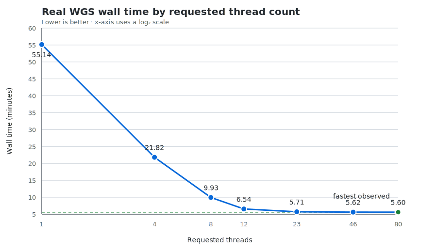

# Real WGS HTSlib thread-scaling benchmark — 2026-07-22

This benchmark measured the version 0.2.0 Docker image on one real WGS BAM at
1, 4, 8, 12, 23, 46, and 80 requested threads. It used the same saved stock
output and BAM as the version 0.1 benchmark. The sample identifier and
infrastructure details are omitted.



## Results

| Threads | Mapped workers¹ | Wall time (s) | Wall time (min) | Speedup vs. `-t 1` | Reduction |
| ---: | ---: | ---: | ---: | ---: | ---: |
| 1 | sequential path | 3308.61 | 55.14 | 1.00× | 0.00% |
| 4 | 3 | 1309.12 | 21.82 | 2.53× | 60.43% |
| 8 | 7 | 596.09 | 9.93 | 5.55× | 81.98% |
| 12 | 11 | 392.53 | 6.54 | 8.43× | 88.14% |
| 23 | 22 | 342.62 | 5.71 | 9.66× | 89.64% |
| 46 | 45 | 337.16 | 5.62 | 9.81× | 89.81% |
| 80 | 79 | **335.88** | **5.60** | **9.85×** | **89.85%** |

¹ For `-t N`, one requested thread is the HTSlib compatibility scanner and up
to `N-1` threads process mapped reference tasks. `-t 1` uses the inherited
sequential implementation.

The raw measurements are in [summary.tsv](summary.tsv).

## Interpretation

Version 0.2 reduced wall time from 55.14 minutes at `-t 1` to 5.60 minutes at
`-t 80`, saving 49.55 minutes and producing a 9.85× speedup. The practical
knee is near `-t 23`: increasing the request from 23 to 80 threads saved only
6.74 seconds, a 1.97% reduction, while requesting 3.48 times as many threads.

The plateau near 23 requested threads is consistent with the scheduler's
whole-reference granularity. `-t 23` supplies 22 mapped-reference workers, so
most long human chromosomes can already run concurrently. A chromosome is not
split between workers; after the shorter references finish, the critical path
is the slowest remaining long reference. Extra workers cannot shorten that
task. The alignment with 22 workers is suggestive rather than proof because
the BAM also contains sex chromosomes, mitochondrial sequence, and smaller
contigs.

Storage and decompression can reinforce the same ceiling. Every worker opens
an independent indexed BAM reader, so sufficiently high concurrency may
saturate shared filesystem throughput, BGZF decompression capacity, memory
bandwidth, or the operating-system page cache. The Docker client user/system
columns do not measure CPU inside the container, so these timings alone cannot
separate reference-task imbalance from I/O or CPU saturation.

Compared with the [version 0.1 benchmark](../real-wgs-2026-07-21/README.md),
the sequential baselines differ by less than 1%, while version 0.2 is 6.75×
faster around 22–23 threads and 6.87× faster at 80 threads. This is consistent
with removal of the old full-file compatibility scan.

For this BAM and infrastructure, `-t 23` is the best practical setting among
those tested. `-t 12` is a reasonable lower-resource choice: it finishes in
6.54 minutes, only 49.91 seconds behind `-t 23`, while requesting roughly half
as many CPUs. Repeated runs would be needed to decide whether the small
differences among 23, 46, and 80 threads are reproducible.

## Output comparison

Every container run exited successfully and produced the same SHA-256:

```text
23a1123550574145e5d3e60fa706c350c576894d13b4e432f374148f1a78c969
```

The saved stock reference has a different whole-file SHA-256:

```text
17bdc6c5d872c397d35d31c8be42b7315f7ba399ebfb25b3157b367c51777626
```

This Docker benchmark mounted the host BAM at `/data`, while inherited TelSeq
writes the input path to stdout. That path difference necessarily changes the
whole-file checksum even when result rows match. The benchmark wrapper on
`master` now preserves the host path inside the container to avoid this false
mismatch. The submitted timing files are still valid, but exact compatibility
should be confirmed with a diff or one run using the corrected wrapper.

## Limitations

- There is one timing observation per thread count.
- Cache state, node model, filesystem throughput, container CPU utilization,
  and storage load were not recorded with the submitted summary.
- Thread settings 23, 46, and 80 are not exact multiples, so the curve is best
  interpreted as a scaling trend rather than a controlled efficiency study.
- Results should not be generalized to a different BAM or storage system
  without benchmarking it directly.
